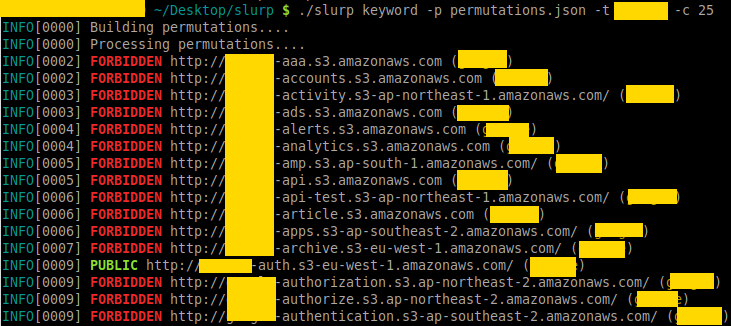

# slurp
Blackbox/whitebox S3 bucket enumerator

## Overview
- Credit to all the vendor packages that made this tool possible.
- This is a security tool; it's meant for pen-testers and security professionals to perform audits of s3 buckets.

### Features
- Scan via domain(s); you can target a single domain or a list of domains
- Scan via keyword(s); you can target a single keyword or a list of keywords
- Scan via AWS credentials; you can target your own AWS account to see which buckets have been exposed
- Colorized output for visual grep
- Currently generates over 28,000 permutations per domain and keyword (thanks to @jakewarren and @random-robbie)
- Punycode support for internationalized domains
- Strong copyleft license (GPLv3)

## Modes
There are two modes that this tool operates at; blackbox and whitebox mode. Whitebox mode (or internal) is significantly faster than blackbox (external) mode.

### Blackbox (external)
In this mode, you are using the permutations list to conduct scans. It will return false positives and there is **no way to link the buckets to an actual aws account!** Do not open issues asking how to do this.

#### Domain

#### Keywords

### Whitebox (internal)
In this mode, you are using the AWS API **with credentials** on a specific account *that you own* to see what is open. This method pulls all S3 buckets and checks Policy/ACL permissions. Note that, I will not provide support on how to use the AWS API. Your credentials should be in `~/.aws/credentials`.

#### internal

## Usage
- `slurp domain <-t|--target> example.com` will enumerate the S3 domains for a specific target.
- `slurp keyword <-t|--target> linux,golang,python` will enumerate S3 buckets based on those 3 key words.
- `slurp internal` performs an internal scan using the AWS API.

## Installation
This project uses `vgo`; you can clone and `go build` or download from Releases section. **Please do not open issues on why you cannot build the project**; this project builds like any other project would in Go, if you cannot build then I strongly suggest you read the [go spec](https://golang.org/ref/spec).

Also, the only binaries I'm including are `linux/amd64`; if you want mac/windows binaries, build it yourself.

## Contributors
- Thanks to @jakewarren and @random-robbie for permutations list(s).
- Thanks to [Yvonni Fhang](https://www.instagram.com/yvonnifhang/) for the logo.
